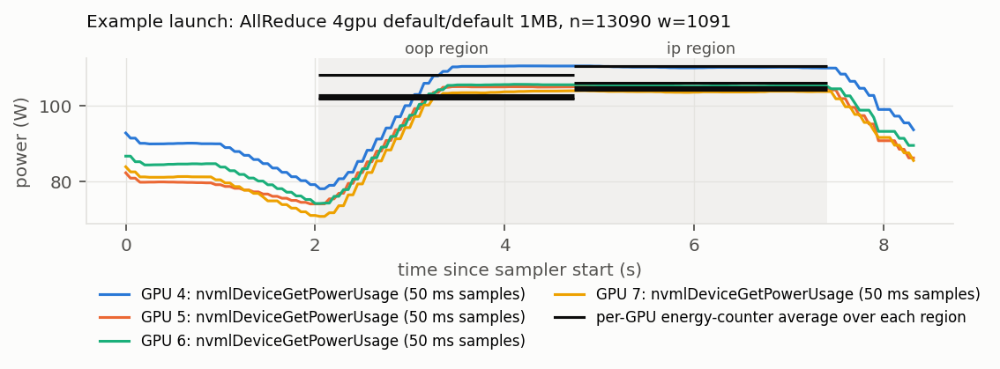

# Smoke test (pipeline validation)

Run before the full sweep, on 2026-10-05, with `configs/smoke.yaml`:
AllReduce/AllGather/ReduceScatter × {2 GPUs (4,5, NVLink pair), 4 GPUs (4–7)}
× algorithm {auto, Ring, Tree} × protocol {auto, LL128} × sizes {4 KiB, 1 MiB,
64 MiB} × 2 trials. Its numbers are **not** used for any result; it exists to
show that parsing and energy measurement work. Generated report:
[`data/processed/smoke/SMOKE_REPORT.md`](../data/processed/smoke/SMOKE_REPORT.md).

`bash scripts/run_smoke.sh` launches a new GPU smoke experiment. It is not
needed to inspect or regenerate the checked-in analysis.

## Checks and outcomes

| check | outcome |
|---|---|
| every planned unit has exactly one final record | PASS — 216 planned, 216 final (168 `ok`, 48 `not_run_probe_unsupported`) |
| `NCCL_ALGO=Tree` for AllGather / ReduceScatter detected as unsupported from NCCL's own error | PASS — 24/24 (cond, size) rows, reason `no algorithm/protocol available for function AllGather ... NCCL_ALGO was set to Tree.` |
| no other probe failures | PASS — 84 ok, 24 unsupported |
| forced algorithm/protocol is what NCCL ran (TUNING log) | PASS — 66/66 forced rows |
| data check `#wrong == 0` (out-of-place and in-place) | PASS — 84/84 supported rows |
| selection identical in start and end probe | PASS — 108/108 |
| re-parsing every stored stdout reproduces the recorded rows | PASS — 168 launches, 0 mismatches |
| timed portion of every region ≥ 2 s | PASS — min 2.078 s; region length median 2.518 s, max 2.745 s |
| region wall-clock per op ÷ nccl-tests time, out-of-place | PASS — median 1.0079, range 1.0030–1.0150 |
| same, in-place | PASS — median 1.0000, range 0.9982–1.0047 |
| energy counter present and > 0 in every region | PASS — 336 regions |
| idle-subtracted energy > 0 in every region | PASS — dynamic share of raw energy median 0.769, min 0.730 |
| integrated `PowerUsage` ÷ counter, region window | INFO — median 0.988, IQR 0.938–1.006, range 0.857–1.025 |
| integrated `PowerUsage` ÷ counter, window shifted +0.5 s | PASS (|median − 1| < 5 %) — median 0.993, IQR 0.987–0.999, range 0.972–1.017 |
| energy/op increases with size for every configuration | PASS — 28/28 |
| out-of-place vs in-place energy/op | INFO — relative difference median +0.06 %, IQR −1.4 % … +0.8 % |
| trial-to-trial coefficient of variation | INFO — energy/op median 0.57 % (max 3.5 %); latency median 0.22 % (max 2.5 %) |
| idle windows reached P8 | PASS — idle W: GPU4 28.96, GPU5 20.95, GPU6 24.94, GPU7 27.61 (median of 6 windows each; spread ≤ 0.9 W) |
| sampler cadence | PASS — median Δt 0.0500 s, max 0.147 s, 2.2 ms NVML time per GPU per sample, 99 overruns |
| foreign processes on target GPUs during timed launches | PASS — none |
| temperature / clocks / P-states during regions | INFO — mean temperature 32.7–40.2 °C (max 41 °C), mean graphics clock 1907–1939 MHz, P-state P2 only |

## What the smoke test showed about the measurement

* **Region detection works.** With unbuffered stdout, the row preamble and the
  two result fields of nccl-tests arrive as separate chunks; regions measured
  this way match the nccl-tests timing to within 1.5 %. The out-of-place
  region is ≈0.8 % longer than `(n+w)·t_op` because it contains the first
  call of the process; its energy per operation nevertheless differs from the
  in-place region by only +0.06 % (median).
* **The two NVML-derived estimates are numerically consistent.** The energy
  counter and the integral of sampled `nvmlDeviceGetPowerUsage` agree to within
  ≈1 % at the median after shifting the integration window by 0.5 s. They are
  not independent sensors. Without the shift, the integral under-reads by up
  to 14 % in individual regions, which is why the counter is primary. The
  figure below shows one launch.

All smoke and full-run configurations set `NCCL_RUNTIME_CONNECT=0` so channel
connection occurs during communicator initialization rather than inside the
measured collective regions. The repository does not retain the earlier
comparison used to choose that setting, so no numerical claim about that
comparison is made here.
